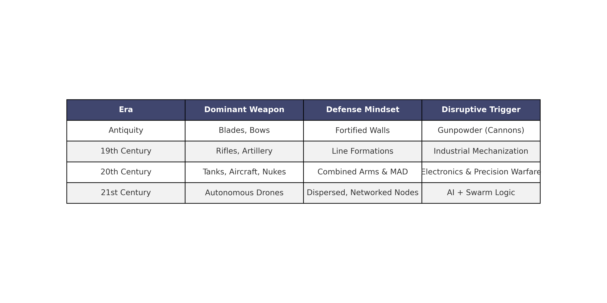

A small drone can force a defender to spend time, ammunition, and attention on a target that costs far less than the system protecting it. Multiply that problem across many aircraft and the challenge extends beyond shooting down a single object. It affects how forces observe, move, resupply, and make decisions.

The comparison with gunpowder is useful as a question about adaptation. It becomes misleading when it implies that older capabilities disappear as soon as a new weapon arrives.

## Distinguish mass from a swarm

Several drones participating in one attack do not necessarily form an autonomous swarm. They may be flown independently, follow preplanned routes, or receive commands from a common controller.

A swarm, as used here, coordinates behavior among multiple aircraft. The design may distribute some decisions, but the amount of autonomy depends on the system. Navigation, formation control, and target selection are separate functions. A demonstration of one does not prove the others.

This distinction matters when interpreting battlefield reporting. The number of aircraft involved cannot establish how they communicated or who controlled their actions.

## Use history carefully

Changes in weapons create pressure to adapt defenses, training, and production. They rarely erase the need for existing capabilities in one step.

| Development | Change worth comparing | Limit of the analogy |
| --- | --- | --- |
| Gunpowder artillery | Pressure on fortifications and siege methods | Fortification adapted rather than disappearing |
| Industrial firepower | Greater demands on supply and force protection | Outcomes still depended on organization and terrain |
| Precision weapons | More selective engagement at distance | Precision required intelligence and support systems |
| Coordinated drones | Distributed sensing and potential saturation | Effectiveness depends on communications, payload, and defenses |

*The infographic is a simplified historical comparison. It should not be read as a claim that each technology made all previous tactics obsolete.*

## Examine the cost problem

Low-cost aircraft can make some defensive engagements expensive. The relevant comparison, however, includes the complete mission: sensors, communications, operators, payloads, replacement aircraft, and support.

A first-person-view drone flown by an operator is also a different system from an autonomous aircraft coordinating with others. Combining their price and performance claims produces an unreliable estimate.

Defenders need to consider detection, electronic warfare, physical protection, and interception together. An inexpensive interceptor may help in one setting, while dispersal or concealment may reduce exposure in another. Effectiveness has to be tested against the actual threat and operating conditions.

## Account for communications and production

Distributed coordination may reduce dependence on a single controller, but it does not eliminate vulnerabilities. Aircraft still need power, sensing, and some way to manage uncertainty. Jamming, navigation errors, and software faults can affect several vehicles at once.

Local fabrication can support repairs and some airframe production. It does not remove dependence on motors, batteries, electronics, and quality control. Training remains necessary for maintenance, planning, operation, and response to failures.

The industrial question is whether a force can supply and sustain the capability under disruption. A large demonstration fleet does not answer that question on its own.

## Keep command responsibility explicit

Autonomy can compress the time available for intervention. Commanders need to understand what decisions the system makes, how its limits are tested, and what happens when communications fail.

Questions about identification, accountability, and escalation become especially important when many aircraft operate together. A technical ability to coordinate movement does not resolve the decision to use force.

## Consider hybrid conflict

Drones can be used for surveillance, probing, or disruption around sensitive infrastructure. Uncertain origin may complicate the response, but a drone sighting by itself does not establish a coordinated hostile campaign.

Connect physical observations with other evidence and preserve alternative explanations. The practical task is to identify the activity, protect the affected service, and determine the response authority.

The lasting implication of coordinated drones is a need to examine the system around the weapon. Production, communications, training, and command arrangements will determine how much of the advertised capability survives contact with actual conditions.
