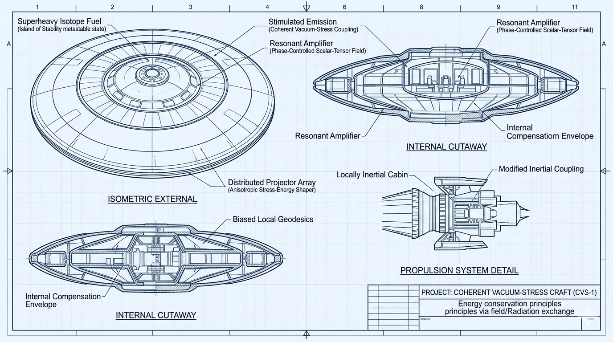
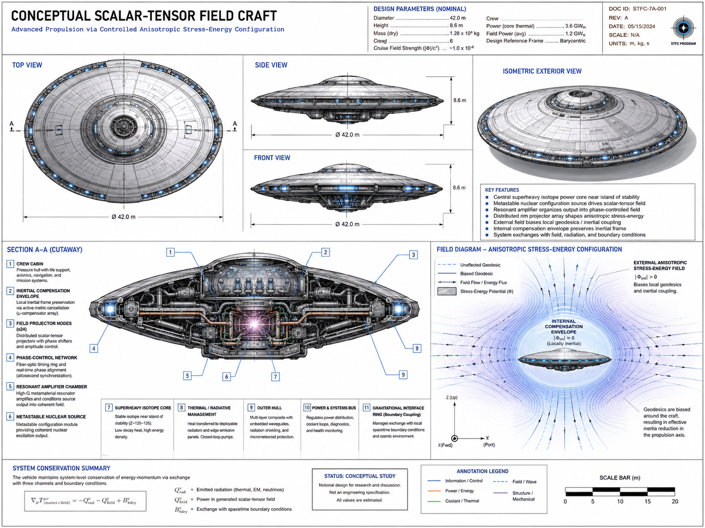

## Abstract

A recurring theme in unidentified aerial phenomena folklore is the claim that a stable superheavy isotope, often described as “Element 115,” could serve as the energy source for a craft capable of manipulating gravity or spacetime. Known moscovium, the real element with atomic number 115, does not support this claim. It is synthetic, radioactive, short-lived, and not available as a macroscopic engineering material.[^1][^2] A serious scientific treatment must therefore separate the folklore object from the physical question: what kind of new coupling would be required for a nuclear-scale source to produce controllable metric or inertial effects?

This article develops a speculative but disciplined model: **Coherent Nuclear–Vacuum Stress Coupling**, or **CNVSC**. In this model, a hypothetical stable superheavy isotope near the island of enhanced stability possesses a metastable nuclear configuration that can be stimulated into releasing energy through a previously unknown coherent vacuum-stress channel. A resonant amplifier organizes this output into a phase-controlled scalar–tensor field. A distributed projector array shapes the field into an anisotropic stress-energy configuration around the craft. The external field biases local geodesics or modifies inertial coupling, while an internal compensation envelope preserves a locally inertial cabin frame.

The purpose is not to argue that such a system exists. The purpose is to define the minimum physics that would have to exist, the engineering architecture that would logically follow, and the falsifiable signatures that would distinguish a physical mechanism from mythology.

## Introduction: From Nuclear Energy to Metric Engineering

Modern nuclear engineering is extraordinarily powerful, but it remains thermodynamic. In nuclear thermal propulsion, reactor heat is transferred to a propellant. In nuclear electric propulsion, reactor heat is converted into electricity, which then powers electric thrusters.[^3] The underlying conversion chain is familiar:

nuclear energy → heat → propellant or electricity → thrust

A speculative metric-propulsion architecture would require a fundamentally different sequence:

nuclear excitation → coherent vacuum or field stress → metric or inertial effect → geodesic motion

This distinction is essential. A conventional nuclear engine produces force by ejecting reaction mass or powering a known field interaction. A metric or inertial craft would instead need to modify the local relationship between stress-energy, spacetime geometry, and inertial response.

General relativity provides the formal opening, but not the engineering solution. The Einstein field equations relate spacetime curvature to stress-energy, including energy density, momentum flux, pressure, and anisotropic stress.[^4] In simplified language, spacetime responds not merely to “mass,” but to the full stress-energy content of a physical system.

That does not imply that useful metric engineering is available. It only states the boundary condition: if a craft were to bias local geodesics or modify inertial coupling, it would need to generate a controllable stress-energy configuration of extraordinary character.

## The Hypothetical Field

The cleanest candidate is not a simple “gravity beam.” A gravity beam implies a directional force projected outward from a source. That framing is too crude. The more precise model is a **scalar–tensor vacuum-stress field**, denoted here as the **Φ-field**.

The field has two conceptual components:

| Component | Function |
|---|---|
| Φ₀ | Scalar modulation of local vacuum-state or coupling conditions |
| Φᵢⱼ | Directional stress, shear, curvature bias, or inertial-frame tensor component |

A purely scalar field could modulate an energy density or local vacuum condition, but it would not easily produce steerable directionality. A tensor component is required if the system is to generate anisotropic stress, directional curvature, inertial-frame bias, or a shaped geodesic gradient.

In physical terms, the field does not “push” the craft in the ordinary rocket sense. It modifies local vacuum stress and inertial boundary conditions around the vehicle, producing a controlled asymmetry in the effective stress-energy tensor.

The total stress-energy content of the system can be represented schematically as:

$$
T_{\text{total}} = T_{\text{matter}} + T_{\text{EM}} + T_{\text{radiation}} + T_{\Phi}
$$

The speculative term is \(T_{\Phi}\): the stress-energy contribution of the hypothetical scalar–tensor vacuum-stress field.

The Casimir effect is relevant here only as a conceptual foothold. It demonstrates that quantum vacuum energy can have measurable physical consequences under constrained boundary conditions.[^5] It does not provide a propulsion mechanism. Known Casimir forces are small, geometry-dependent, and not capable of producing macroscopic controlled metric effects. The leap required by CNVSC is therefore large: a nuclear system would need to couple coherently and efficiently to a vacuum-stress channel that is not presently part of established engineering physics.


## The Source Term: What the Superheavy Isotope Would Have to Contribute

Known moscovium cannot play the role assigned to it in folklore. For this model, “Element 115” must be treated as shorthand for a hypothetical stable or metastable superheavy isotope near the island of enhanced stability. Research on superheavy elements does discuss enhanced stability in certain regions of the nuclear chart, but this is not the same as having a stable bulk material suitable for propulsion engineering.[^6]

The isotope’s role would not be ordinary fuel. It would be a **nuclear-field transducer**.

It would need to provide three properties.

First, it must contain accessible nuclear excitation energy. Nuclear isomers are real: nuclei can occupy metastable excited states, including in heavy nuclei.[^7] This gives the idea a narrow research-adjacent anchor. A nucleus can store energy in a long-lived configuration.

Second, it must possess a coherent release pathway. Ordinary nuclear decay is largely incoherent from an engineering-control perspective. It produces particles, gamma radiation, heat, and daughter products. The hypothetical isotope would instead need a transition pathway of the following form:

metastable nuclear state → coherent Φ-field excitation

That transition is the first major new-physics requirement.

Third, it must couple strongly to vacuum stress. The source term can be written schematically:

$$
S_{115} = \eta \cdot \rho_n \cdot C_{nv}
$$

| Symbol | Meaning |
|---|---|
| \(S_{115}\) | Effective source strength of the superheavy isotope core |
| \(\eta\) | Nuclear excitation efficiency |
| \(\rho_n\) | Available nuclear energy density |
| \(C_{nv}\) | Nuclear-to-vacuum-stress coupling coefficient |

In known physics, \(C_{nv}\) is effectively nonexistent or negligibly small for propulsion purposes. The speculative model requires:

$$
C_{nv} \gg C_{\text{known gravitational coupling}}
$$

That inequality is the center of the entire hypothesis. Without it, the system collapses back into ordinary nuclear engineering: heat, radiation, shielding, turbines, propellant, and electric power.

## Resonant Amplification and Phase Coherence

The amplifier cannot create energy. It cannot make the propulsion problem disappear through language. Its role is to impose coherence, select usable modes, and distribute field phase across the craft.

The conceptual chain is:

superheavy isotope excitation  
→ raw Φ-field emission  
→ mode-selection cavity  
→ coherence amplifier  
→ phase-locked distribution manifold  
→ projector array

The amplifier performs three functions.

First, it selects the usable field mode:

$$
\Phi_{\text{raw}} \rightarrow \Phi_{\text{mode}(n)}
$$

Second, it phase-locks the field across multiple emitters:

$$
\Phi_i(t) = A_i \cos(\omega t + \phi_i)
$$

Where \(A_i\) is amplitude, \(\omega\) is angular frequency, and \(\phi_i\) is the phase offset at projector \(i\).

Third, it provides gain:

$$
G = \frac{\Phi_{\text{output}}}{\Phi_{\text{seed}}}
$$

This gain is not free energy. It is analogous to the way a small coherent signal can control a larger stored energy reservoir in an amplifier. In this speculative system, the reservoir is the nuclear excitation state of the superheavy core.

The critical engineering risk is coherence collapse. If coherence is lost, the system ceases to behave like a field-control architecture and becomes a radiation, thermal, and containment emergency.

## The Projector Array as a Metric Phased Array

The projector array is best understood as a **metric phased array**. Its function is not to expel propellant. Its function is to shape the external stress-energy or inertial-gradient geometry around the craft.

A useful conceptual configuration is:

- 12 primary projector nodes arranged radially around the vehicle.
- 3 lower high-power projectors for lift or translation.
- 6 secondary lensing nodes for trim and gradient shaping.
- 1 central inertial-envelope stabilizer.



A simplified top-down layout:

```text
          P12     P1      P2
      P11                 P3

   P10         [CORE]         P4

      P9                  P5
           P8     P7    P6

